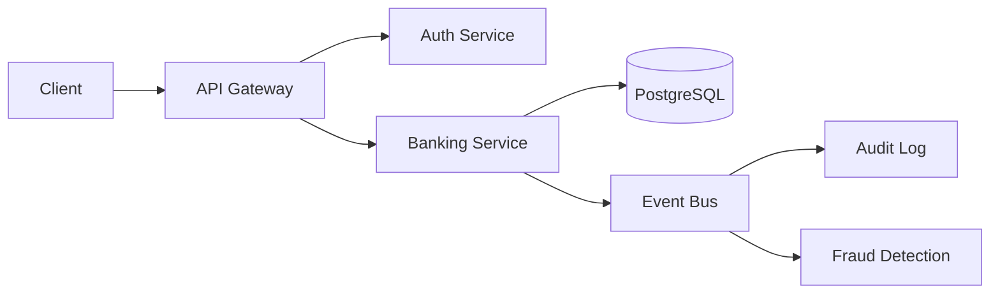

# Regulatory Reporting Platform

[](https://github.com/koketseraphasha/regulatory-reporting-platform/actions/workflows/ci.yml)

Financial compliance and regulatory reporting platform. Generate transaction reports, risk reports, compliance reports, and audit reports.

## Features
- Transaction reporting
- Risk reporting
- Compliance monitoring
- Audit report generation
- Regulatory framework mapping
- Export to PDF/CSV/Excel


## Architecture



Microservices-based architecture with API Gateway, authentication layer, PostgreSQL persistence, and event-driven communication.

## Stack
Java 21, Spring Boot, PostgreSQL, Docker

## Quick Start
```bash
docker compose up -d
```

## Deployment & Architecture

This project is designed with cloud-ready principles:

- **Containerized** using Docker for consistent deployment
- **Environment-based configuration** — no hardcoded secrets
- **Modular structure** for independent scaling
- **Stateless design** where applicable
- **Separation of concerns** for maintainability

### Run Locally

`ash
docker-compose up --build
`

---

*Part of the Kirov Dynamics Technology portfolio — backend engineering focused on security, scalability, and system design.*
